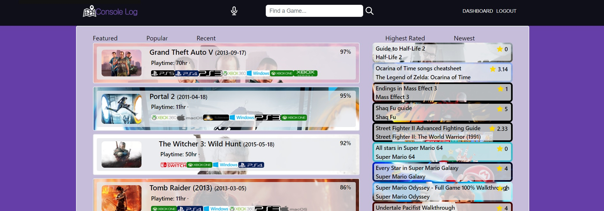

# Console Log

## Description

A hub for players to store walkthroughs for their favorite video games!

Create a user profile and start saving text or links to your favorite walkthroughs.

View, rate, and favorite walkthroughs posted by other users!

Search for games using voice commands!

## Table of Contents

- [Installation](##🛠️Installation)
- [Usage](##📐Usage)
- [License](##📋License)
- [Contributing](##📝Contributing)
- [Tests](##✔️Tests)

## Usage

Click the image below to check out the deployed application!

## Questions

Questions? Contact one of us via the links below!

------------
## 🛠️Installation
To install necessary dependencies, run the following command:

npm install

------------
## 📐Usage
Please see below for instructions on usage:

Will need to update their .env with a valid RAWG key

------------
## 📋License
This project is covered under the [MIT](https://opensource.org/licenses/MIT) license.

------------
## 📝Contributing

- Sung Kim: [sungjk77](https://github.com/sungjk77)
        - sungjk@uw.edu

- Robert Adams: [comatosino](https://github.com/comatosino)

- Aurora Duncan: [aurorabrynn](https://github.com/aurorabrynn)

------------
## ✔️Tests
To test the program, please run the following:

n/a

    

